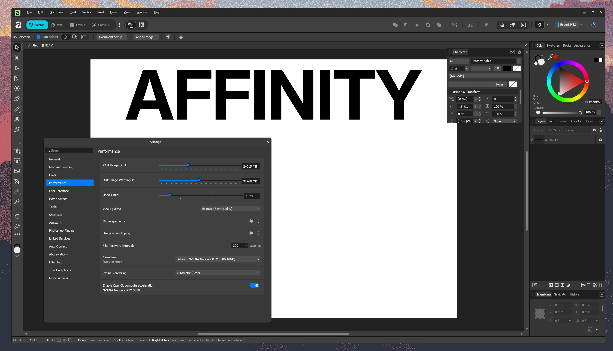

# run-affinity

Run Affinity natively on any Linux distribution (although only tested on Cachy OS / Arch Linux)

Provides a fully self-contained, portable Wine environment with all dependencies pre-configured. Just run the installer and you should be ready to go in no time.



## Requirements

- A 64-bit Linux distribution
- Vulkan-capable GPU with up-to-date drivers
- `wget`, `tar`, `zstd` (for extraction)
- `7z` or `unzip` (for WinMetadata restoration)
- `zenity` (optional, for DPI configuration dialog. If you have a high DPI screen, you DO need to configure this)

## Important: XWayland required

Affinity **must run under XWayland**, not native Wayland. This is because it relies on DXVK for Direct3D translation, and DXVK does not work correctly under Wine's Wayland driver — expect rendering glitches, blank windows, and broken GPU OpenCL acceleration.

Wine's default behavior is to prefer the X11 driver when both X11 and Wayland are available, so **this should work out of the box on most setups**. However, if you have forced Wine to use Wayland (e.g. by unsetting `DISPLAY`), Affinity will not work properly.

> **From Wine's release notes:** *"The Wayland graphics driver is enabled by default, but the X11 driver still takes precedence if both are available. To force using the Wayland driver in that case, make sure that the DISPLAY environment variable is unset."*
>
> For Affinity, you want the opposite — make sure `DISPLAY` **is** set so Wine uses XWayland.

## Quick Install

```bash
bash <(curl -fsSL https://raw.githubusercontent.com/Arecsu/run-affinity/main/install.sh)
```

The script will download the preconfigured wine prefix (~1.2 GB) from GitHub Releases automatically, and also Affinity latest installer.

## Manual Install

1. Download `install.sh` and `affinity-base.tar.zst` from the [latest release](https://github.com/Arecsu/run-affinity/releases/latest).
2. Place them in the same directory.
3. Run:
   ```bash
   chmod +x install.sh
   ./install.sh
   ```
4. Follow the Affinity installer GUI when it appears.
5. Set your preferred DPI scaling when prompted.

## Package

### Base
- **Wine 11.5 staging-tkg** (Kron4ek build) with NTSync support
- Fully portable. Installs to `~/.local/share/affinity/`, no system libraries modified
- **DXVK 2.7.1** — Vulkan-based Direct3D 9/10/11 translation
- **vkd3d-proton 3.0b** — Vulkan-based Direct3D 12 translation

### Custom Patched DLLs
Built from [wine-affinity](https://github.com/Arecsu/wine-affinity) patches:
- **d2d1.dll** — Patched Direct2D with Affinity-specific fixes (stub `Widen`, bezier recursion guard, cubic-to-quadratic subdivision for accurate path rendering, collinear outline join fix)
- **dxcore.dll** — Full GPU adapter enumeration (upstream Wine's is a stub), with correct PCI ID reporting through DXVK
- **opencl.dll** — Patched OpenCL with `cl_khr_d3d10_sharing` extension support, enabling GPU-accelerated OpenCL in Affinity
- **comdlg32.dll** — Patched file dialog with XDG Desktop Portal support for native file pickers

### Pre-installed Libraries (via winetricks)
- .NET Framework 4.8
- Visual C++ Redistributables
- Microsoft EdgeWebView2 Runtime (for Affinity's built-in browser panels)
- Core fonts

### Features
- GPU OpenCL acceleration works (NVIDIA tested, no idea about AMD/Intel)
- Native file dialogs via XDG Desktop Portal (requires `xdg-desktop-portal` + a backend) — configure in `affinity --winecfg` → Desktop Integration
- DPI scaling configuration via `affinity --dpi` (requires zenity)
- Desktop / Application entry
- AffinityPluginLoader + WineFix applied automatically (settings save correctly on Linux)

## Usage

```bash
affinity              # Launch Affinity
affinity --dpi        # Configure DPI scaling
affinity --winecfg    # Open Wine configuration
affinity --help       # Show usage
```

Or launch from your application menu.

### Updating Affinity

Updates only the Affinity application. Wine, patched DLLs, and all preferences are left untouched.

```bash
./install.sh --update
```

### Upgrading Wine + DLLs

Updates Wine, patched DLLs, and Affinity while **preserving user preferences** (settings, workspaces, licence, etc.).

```bash
./install.sh --upgrade
```

### Reinstalling

Wipes everything and starts fresh. **All preferences and data will be lost.**

```bash
./install.sh --reinstall
```

### Providing Your Own Installer

```bash
./install.sh --installer /path/to/Affinity-x64.exe
```

## Component Versions

| Component | Version |
|-----------|---------|
| Wine | 11.5 staging-tkg (Kron4ek, NTSync) |
| DXVK | 2.7.1 |
| vkd3d-proton | 3.0b |
| .NET Framework | 4.8 |
| EdgeWebView2 | 142.0.3595.94 |
| Custom DLLs | [wine-affinity](https://github.com/Arecsu/wine-affinity) patches |

## Credits

- [wine-affinity](https://github.com/Arecsu/wine-affinity) — Wine patches for Affinity (d2d1, dxcore, opencl, comdlg32)
- [Alexander Wilms](https://gitlab.winehq.org/wine/wine/-/merge_requests/10060) — XDG Desktop Portal file dialog integration (Wine MR !10060)
- [Kron4ek/Wine-Builds](https://github.com/Kron4ek/Wine-Builds) — portable Wine builds
- [ElementalWarrior (James McDonnell)](https://gitlab.winehq.org/ElementalWarrior/wine) — original Affinity Wine patches
- [doitsujin/dxvk](https://github.com/doitsujin/dxvk) — DXVK
- [HansKristian-Work/vkd3d-proton](https://github.com/HansKristian-Work/vkd3d-proton) — vkd3d-proton
- [noahc3/AffinityPluginLoader](https://github.com/noahc3/AffinityPluginLoader) — Plugin loader + WineFix
- [seapear/AffinityOnLinux](https://github.com/seapear/AffinityOnLinux) — reference installer and icon
